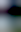

# blurhash

cli blurhash tool

## features
- auto-scales images

## install
### from source
```sh
git clone https://github.com/0xf0xx0/blurhash.git
cd blurhash
go build
go install
```

## usage
```console
$ blurhash boat-on-lake/final.jpg
TLAn4P_4%MDjV@t7-;%Mt7.9x]xu 21,32
```

```console
$ blurhash --decode 'TLAn4P_4%MDjV@t7-;%Mt7.9x]xu' --width 21 --height 32 --output examples/final-blur.png
```

